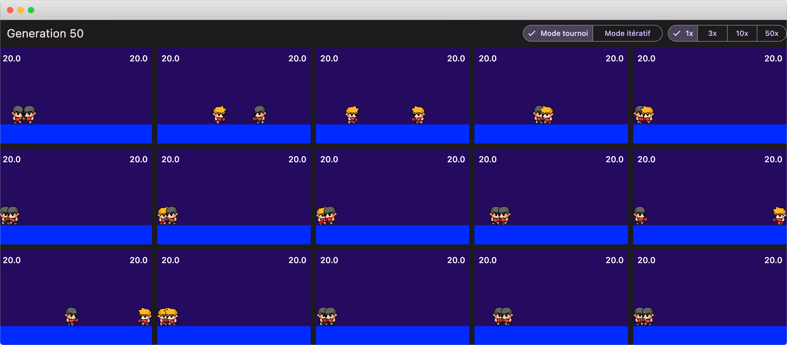

# bagarre

>AI learn boxing using neural networks and genetics algorithm.
Made with [Flutter](https://flutter.dev/) and [Flame](https://pub.dev/packages/flame) package as game engine.

*Work in progress*

<br />



<br />

## How to run

1. Install [Flutter](https://flutter.dev/docs/get-started/install)
2. Install [Python 3](https://www.python.org/downloads/) (only for sprites resizing)
3. Clone this repository
4. Add player sprites (see below)
5. Run `flutter pub get` to install dependencies
6. Run `flutter run` to run the app

### Player sprites
  
Player's sprites are not included in this repository because of copyright. You can get them from [GameDev Market](https://www.gamedevmarket.net/asset/boxer-game-sprites-01/).

When you have download the sprites, decompress them, go to `_PNG` folder and move the three folders `Boxer01, Boxer02, Boxer03` to assets/sprites/ like this :

```
assets/sprites/Boxer01/...
assets/sprites/Boxer02/...
assets/sprites/Boxer03/...
```

Then from project's root folder run :

```
cd assets/ && python3 resizer.py && cd ..
```

<br />

*If you want to use your own sprites, you have to adapt the code in `lib/game/entities/entity_player.dart`*

<br />

## How to contribute

1. Fork this repository
2. Create a new branch
3. Make your changes
4. Create a pull request